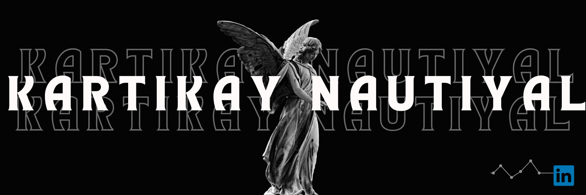

<!--Banner-->

 
 

    
    

<h1 align="center"> Hi  , I'm Kartikay Nautiyal</h1>
<h3 align="center">A Passionate Data Analyst🧑🏻‍💻, from India</h3>
<h6 align="center">Data Analyst | Python | SQL | Excel | Power BI | Tableau | Turning Data into Actionable Insights</h6>
 
 

  

- 🎓 **Bachelor of Computer Applications (BCA) Graduate**

- 💼 Former **Analyst at Coforge**

- 📊 Passionate about **Data Analytics, Business Intelligence, and Automation**

- 📈 Interested in transforming raw data into meaningful business insights

- 💻 Building projects using **Python, SQL, Excel, Power BI, Git & GitHub**

- 🚀 Open to opportunities in **Data Analytics**

- 📫 Reach me at <a href="https://www.linkedin.com/in/kartikay-nautiyal-251a55263/" target="_blank">LinkedIn</a>

<!--
📄 Know about my experiences ~~~

-->
- ⚡ Fun fact **I think I'm Funny...😅**
 

     
    

     
        
    

  

  

Hi, I'm <strong>Kartikay Nautiyal</strong>, a Data Analytics enthusiast with professional experience in the <strong>Analyst</strong> domain at <strong>Coforge</strong>.

I enjoy solving real-world problems using data and building practical solutions with <strong>Python</strong> and <strong>SQL</strong>. My GitHub serves as a collection of projects that reflect my continuous focus on analytics, automation, and problem solving.

I would like to utilize my technical expertise by working with a team that focuses on skill development.

<!-- my summary end -->

<!--Night Owl image-->

  

### What you'll find here

- 📊 Data Analytics Projects

- 🐍 Python Projects

- 🗄 SQL Practice & Database Projects

- 📈 Excel & Power BI Dashboards

- ⚙ Automation Scripts
  
- 💡 Continuous improvements through practical projects
 

<h1 align="center">Tᴇᴄʜ sᴛᴀᴄᴋ</h1>
<picture>
  <source media="(prefers-color-scheme: dark)" srcset="./Skills_Animation_Dark.gif">
  <source media="(prefers-color-scheme: light)" srcset="./Skills_Animation_White.gif">
  
</picture>

<h3 align="left">Areas of Expertise</h3>
<ul align="left">
  <li>I enjoy turning raw data into meaningful insights using Python, SQL, Excel, and Power BI.</li>
  <li> I love learning new technologies and building projects that solve real-world problems.</li>
  <li>Improving my skills in cloud computing with AWS and Azure.
  My GitHub is where I document my learning journey and the projects I build along the way.</li>
</ul>
  
<h3 align="left">FEEL FREE TO CONNECT WITH ME ANYTIME:</h3>

<!--Profile Count Badge-->

  

 
 

 

    

 

    <!-- github streak start -->
    
    <!-- github streak end -->
    <!-- github stats start -->
    
    <!-- github stats end -->

    <!-- github most used languages start -->
    
    <!-- github most used languages end -->

    

<!-- github trophy start -->

  
  

<!-- github trophy end -->

    

<!--Dynamic Quote card updates everyday at 12 PM--> 
<h2 align="center">🌟 Tʜᴏᴜɢʜᴛ ᴏғ ᴛʜᴇ Dᴀʏ 🌟</h2>

<!--STARTS_HERE_QUOTE_CARD-->

    

<!--ENDS_HERE_QUOTE_CARD-->

    

 
<be/>
